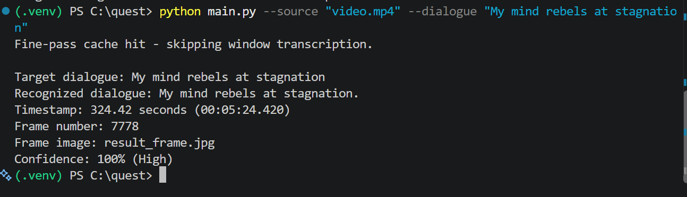
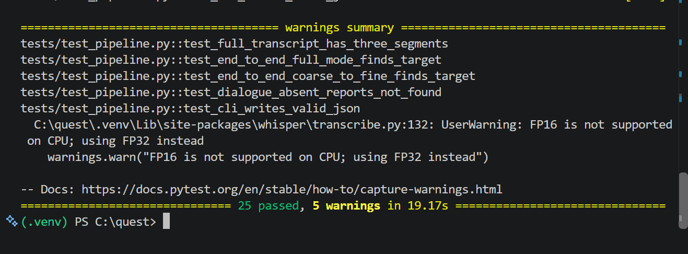
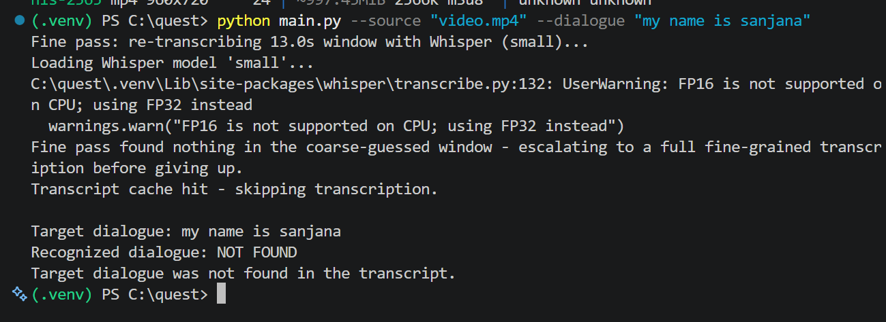
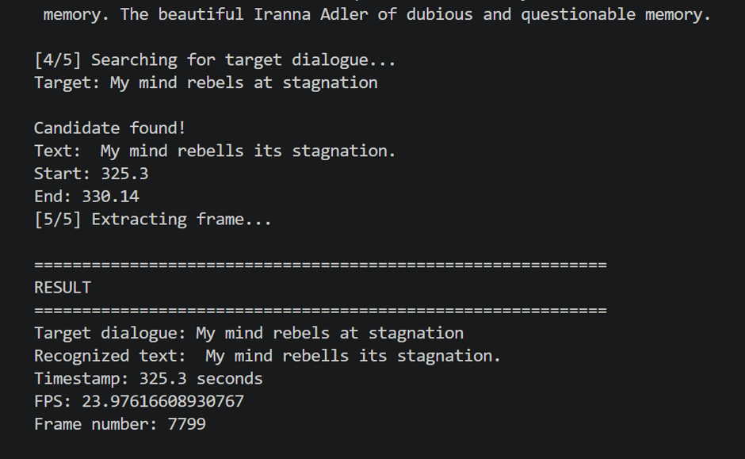

# Video Dialogue Frame Extraction

An AI-assisted video processing pipeline that identifies a specified dialogue in a video, determines its timestamp and frame number, extracts the corresponding video frame, and reports the recognized dialogue text with a confidence indicator.

## What the solution does

Given:
- a local video file
- a target dialogue

the pipeline:

1. Searches the video for the target dialogue.
2. Uses speech transcription to identify candidate dialogue segments.
3. Uses a coarse-to-fine search strategy to reduce unnecessary transcription work.
4. Matches the target against the recognized transcript.
5. Resolves the most relevant timestamp for the dialogue.
6. Extracts the corresponding video frame.
7. Reports:
   - timestamp
   - frame number
   - recognized dialogue
   - extracted frame image
   - confidence level when available

## Example Result

For the target dialogue:

> `My mind rebels at stagnation`

the final pipeline produced:

- **Recognized dialogue:** `My mind rebels its stagnation.`
- **Timestamp:** `324.42 seconds (00:05:24.420)`
- **Frame number:** `7778`
- **Frame image:** `result_frame.jpg`
- **Confidence:** `100% (High)`

The transcript wording is not forced to equal the input query; the pipeline reports the speech recognized by the transcription model.

## Project Structure

```text
quest/
├── main.py
├── requirements.txt
├── requirements-dev.txt
├── tests/
│   └── ...
├── video.mp4                  # input video (not required in the repository)
├── result_frame.jpg           # generated output frame
├── prompts.md                 # prompts used during development
├── APPROACH.md                # design and approach documentation
├── README.md
└── evidence/
    ├── evidence_final_not_found.png
    ├── evidence_final_success.png
    ├── evidence_result_frame.png
    ├── evidence_tests_passed.png
    └── evidence_baseline.png
```

> **Note:** Keep the evidence screenshots in an `evidence/` folder in the GitHub repository. The screenshots below assume that folder structure.

---

# Setup and Installation

## 1. Open the project folder

```powershell
cd C:\quest
```

Replace `C:\quest` with the location of the project on your machine.

## 2. Create a Python virtual environment

```powershell
python -m venv .venv
```

## 3. Activate the virtual environment

### Windows PowerShell

```powershell
.venv\Scripts\Activate.ps1
```

If PowerShell blocks script execution, use:

```powershell
Set-ExecutionPolicy -ExecutionPolicy RemoteSigned -Scope CurrentUser
```

Then activate again:

```powershell
.venv\Scripts\Activate.ps1
```

You should see:

```text
(.venv) PS C:\quest>
```

## 4. Upgrade pip

```powershell
python -m pip install --upgrade pip
```

## 5. Install the project requirements

```powershell
python -m pip install -r requirements.txt
```

## 6. Install development/test requirements

```powershell
python -m pip install -r requirements-dev.txt
```

## 7. Install yt-dlp with Chrome impersonation support

```powershell
python -m pip install -U "yt-dlp[curl-cffi]"
```

## 8. Verify curl_cffi

```powershell
python -c "import curl_cffi; print(curl_cffi.__version__)"
```

A version number should be printed.

---

# Obtaining the Input Video

The pipeline accepts a local video file.

For example, if the video is named:

```text
video.mp4
```

place it in the project directory:

```text
C:\quest\video.mp4
```

## Downloading a video with yt-dlp

For the provided OK.ru video, the command used during development was:

```powershell
python -m yt_dlp --impersonate chrome --retries 20 --fragment-retries 20 -f "best[ext=mp4]/best" "https://ok.ru/video/248244667877"
```

A resolution-limited version can also be used:

```powershell
python -m yt_dlp --impersonate chrome --retries 20 --fragment-retries 20 -f "best[height<=480][ext=mp4]/best[height<=480]/best" "https://ok.ru/video/248244667877"
```

## Choosing a resolution

To inspect the formats available for a video:

```powershell
python -m yt_dlp -F "VIDEO_URL"
```

For example:

```powershell
python -m yt_dlp -F "https://ok.ru/video/248244667877"
```

This displays available resolutions and format IDs.

For the tested video, available HLS resolutions included:

```text
192x144
320x240
480x360
640x480
960x720
```

If a specific maximum resolution is required, the format selector can be adjusted accordingly.

For example, to select the best available MP4 at or below 480p:

```powershell
-f "best[height<=480][ext=mp4]/best[height<=480]/best"
```

The important point is that `-F` should be used first when you need to inspect what formats a particular video actually provides.

---

# Running the Pipeline

## Basic command

```powershell
python main.py --source "video.mp4" --dialogue "My mind rebels at stagnation"
```

Replace:

- `video.mp4` with your input video
- `My mind rebels at stagnation` with the dialogue you want to find

### Example

```powershell
python main.py --source "video.mp4" --dialogue "My mind rebels at stagnation"
```

A successful run reports information similar to:

```text
Target dialogue: My mind rebels at stagnation
Recognized dialogue: My mind rebels at stagnation.
Timestamp: 324.42 seconds (00:05:24.420)
Frame number: 7778
Frame image: result_frame.jpg
Confidence: 100% (High)
```

The generated frame is written to the output location used by the implementation, for example:

```text
result_frame.jpg
```

---

# Running the Tests

Run the complete test suite with:

```powershell
pytest tests/ -v
```

The final implementation was tested with:

```text
25 passed, 5 warnings in 19.17s
```

The warnings included the expected CPU Whisper warning:

```text
FP16 is not supported on CPU; using FP32 instead
```

This is a warning rather than a test failure.

---

# Evidence

The following screenshots document the development and final validation of the solution.

## 1. Final pipeline: successful dialogue identification

This run demonstrates the final pipeline identifying the target dialogue and returning the timestamp, frame number, frame image, and confidence.



## 2. Extracted result frame

The corresponding video frame extracted by the pipeline:


## 3. Final test suite

The final automated test run:

```text
25 passed, 5 warnings in 19.17s
```



## 4. Handling a dialogue that is not found

The final pipeline can also report when the requested dialogue is not found:

```text
Target dialogue: my name is sanjana
Recognized dialogue: NOT FOUND
Target dialogue was not found in the transcript.
```



## 5. Baseline comparison

An earlier baseline run is included for development comparison. It did not provide the final confidence reporting and produced a less accurate result.



The baseline screenshot is included as development evidence rather than as the final expected output.

---

# Development Notes

## Video download issue

During development, video downloading initially failed with a connection-reset error. Closing Chrome tabs changed the network/session conditions, after which the download worked successfully.

The working yt-dlp command used Chrome impersonation and retry options:

```powershell
python -m yt_dlp --impersonate chrome --retries 20 --fragment-retries 20 -f "best[ext=mp4]/best" "https://ok.ru/video/248244667877"
```

This was useful for diagnosing the issue because the successful download showed that the installation and command configuration were valid; the earlier failure was related to the network/session conditions.

## Whisper vs WhisperX

WhisperX was considered during development because it can provide faster/optimized transcription workflows and alignment capabilities.

The final implementation retained the existing Whisper-based approach because it was already producing good and sufficiently accurate results for the target task. Introducing WhisperX would add another dependency and implementation layer without being necessary for the current requirements.

---

# Reproducibility Checklist

For a fresh machine, follow these commands in order:

```powershell
cd C:\quest

python -m venv .venv

.venv\Scripts\Activate.ps1

python -m pip install --upgrade pip

python -m pip install -r requirements.txt

python -m pip install -r requirements-dev.txt

python -m pip install -U "yt-dlp[curl-cffi]"

python -c "import curl_cffi; print(curl_cffi.__version__)"
```

Then place the input video in the project folder and run:

```powershell
python main.py --source "video.mp4" --dialogue "My mind rebels at stagnation"
```

Run the tests:

```powershell
pytest tests/ -v
```

---

# Input and Output

### Input

```text
Video file + target dialogue
```

Example:

```powershell
python main.py --source "video.mp4" --dialogue "My mind rebels at stagnation"
```

### Output

The solution identifies and reports:

```text
Timestamp
Frame number
Recognized dialogue
Frame image
Confidence
```

If the dialogue cannot be reliably located, the system reports:

```text
NOT FOUND
```

rather than returning an arbitrary frame.

---

# Documentation

Additional project documentation:

- `APPROACH.md` — design, processing pipeline, search strategy, frame selection, transcription, and uncertainty handling.
- `prompts.md` — prompts used with AI/LLM tools during solution development.

These documents are intended to make the implementation reproducible and explainable during evaluation.
